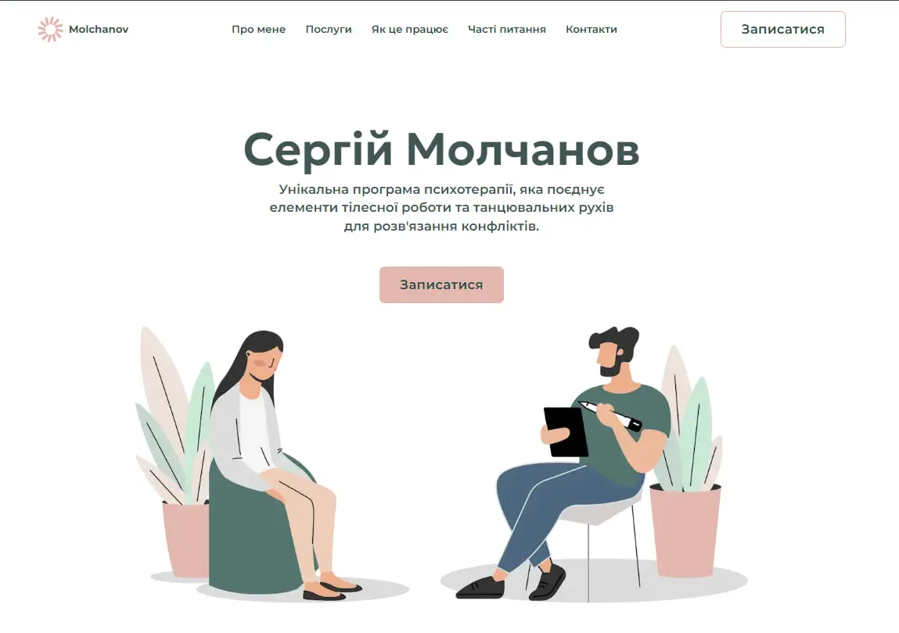

# Serhiy Molchanov - Unique Psychotherapy Program

## About the Project

The **Serhiy Molchanov** website presents a unique psychotherapy program that combines elements of bodywork and dance movements to resolve conflicts. The website also offers the possibility to book a consultation.

### Main Services:

- Assistance in building happy family relationships.
- Working with the psychological causes of physical problems.
- Psychological support in resolving anxiety and fears.
- Working with low self-esteem and lack of confidence.
- Dance classes for teenagers and adults with special needs.
- Dance classes for adults: Salsa, Bachata, Kizomba.

### Target Audience:

- Couples looking to improve their relationships and seeking advice.
- People facing crisis situations like depression, anxiety, eating disorders, and more.
- Teenagers and adults with special needs (autism, intellectual disabilities).
- Those who wish to develop communication skills with others.

### Therapy Stages:

1. **Application**: Submit an application and receive a 15-minute free consultation.
2. **Start**: Begin sessions that will be held 1-2 times a week.
3. **Tracking**: Follow recommendations, monitor and discuss results.
4. **Result**: Activate potential that leads to an improved quality of life.

## Let’s Get Acquainted

I am Serhiy Molchanov, a psychologist and psychotherapist. My mission is to be there in difficult times, help people understand themselves better, and find ways to overcome life’s challenges. My education and experience include body-oriented, dance movement, conflict-centered, and crisis therapy.

### Achievements:

- Order "For Assistance to the Army" from Zaluzhny for psychological help.
- Grand Prix at the national festival "Nova Nazva" in 2023 and 2024.
- Gratitude from Mayor B. Filatov as a psychology teacher.

## Frequently Asked Questions

1. **How do I book a consultation?** Fill out the form on the website.
2. **What services do you provide?** The full list of services can be found above.
3. **How does therapy work?** Therapy is carried out in several stages, starting with a free consultation.

## Getting Started

To start working with the project locally, follow these steps:

### Clone the Repository:

`git clone https://github.com/SoftRyzen-internship/molchanov-pchychoterapist/pull/72`

### Install Dependencies:

`yarn install`

### Run the Application:

`yarn dev`

### Open in Your Browser:

[http://localhost:3000](http://localhost:3000)

## Technologies Used

1. **Next.js** - A React framework for building modern web applications with server-side rendering and efficient routing.
2. **Tailwind CSS** - A utility-first CSS framework that accelerates the design and styling of web interfaces.
3. **TypeScript** - A strict syntactical superset of JavaScript providing optional static typing for better code clarity.
4. **Swiper** - A mobile-friendly touch slider with hardware-accelerated transitions and smooth interactions.
5. **React Hook Form** - A library for managing form state in React applications.
6. **Sanity** - A headless CMS for managing content with a flexible API and powerful features like real-time collaboration.

## Design

The design layout was created in Figma. You can view it [here](https://www.figma.com/design/boyRGW6pbLeSH5XkC9fc7a/Molchanov-Pchychoterapist?node-id=1-2&t=0VXuA4Bfhb61jF5v-0).

## Component API

Each component in the project has its own API, which can be found in the corresponding component's folder.

- #### component Socials

| Prop      | Default | Description                                                                            |
| --------- | ------- | -------------------------------------------------------------------------------------- |
| `section` | --      | optional, `string`, determines the color scheme based on the section (e.g., 'footer'). |
| `gap`     | 'gap-8' | optional, `string`, adds custom gap between the social icons.                          |

- #### component Logo

| Prop     | Default | Description |
| -------- | ------- | ----------- |
| no props | --      |             |

- #### component Button

| Prop       | Type      | Default  | Description                                                                    |
| ---------- | --------- | -------- | ------------------------------------------------------------------------------ |
| `type`     | string    | 'button' | optional, sets the button type.                                                |
| `onClick`  | function  | --       | required,function that will be called on click; scrolls to a specific section. |
| `children` | ReactNode | --       | required, button content, can be text or element.                              |

- #### component NavMenu

| Prop          | Type     | Default | Description                                                                                           |
| ------------- | -------- | ------- | ----------------------------------------------------------------------------------------------------- |
| `section`     | string   | --      | optional, defines a color scheme depending on the section (for example,'footer', 'burger', 'header'). |
| `toggleModal` | function | --      | optional, function to control the opening/closing of a modal window.                                  |

- #### component Modal

| Prop        | Type      | Default | Description                                              |
| ----------- | --------- | ------- | -------------------------------------------------------- |
| `children`  | ReactNode | --      | required, the content to be displayed inside the modal.  |
| `isOpen`    | boolean   | --      | required, controls whether the modal is open or closed.  |
| `setIsOpen` | function  | --      | required, function to set the modal's open/closed state. |

- #### component Slider

| Prop       | Type      | Default | Description                                                        |
| ---------- | --------- | ------- | ------------------------------------------------------------------ |
| `children` | ReactNode | --      | required, elements that will be displayed in the slider as slides. |

## Contact Information

SoftRyzen is ready to answer your questions and provide additional information:

- **Website**: [softryzen.com](http://softryzen.com)
- **Phone**: +380979769625
- **Email**: [m.kozlov@softryzen.com](mailto:m.kozlov@softryzen.com)
